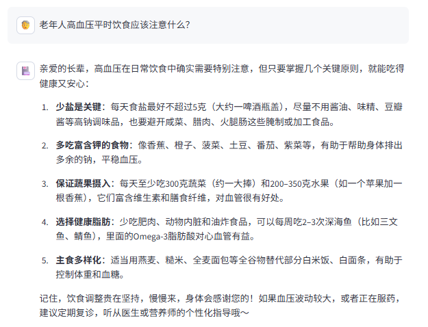
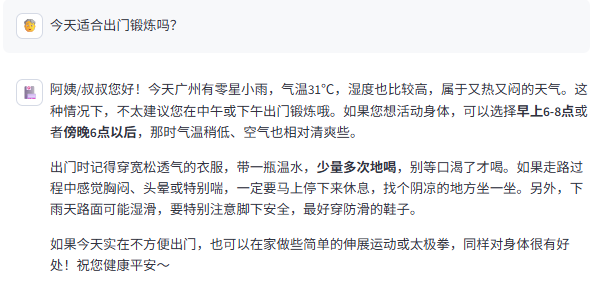
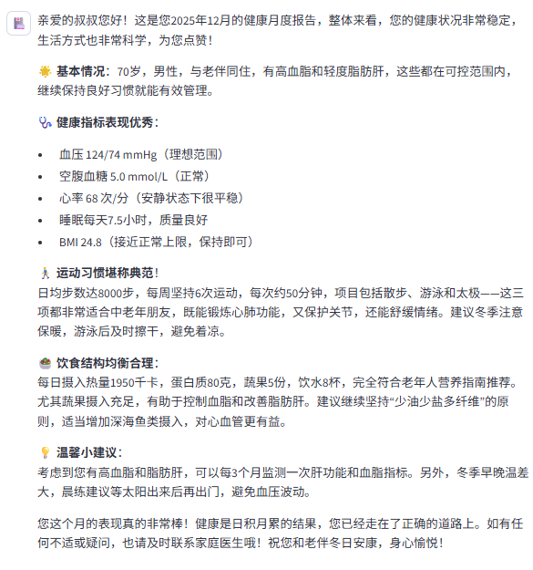
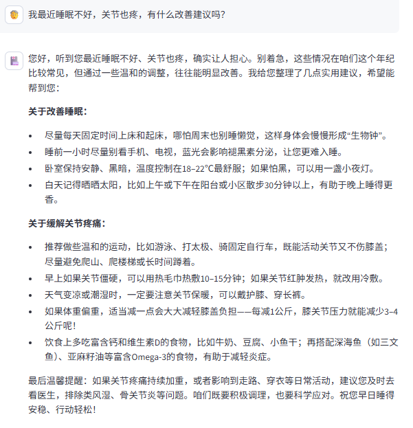

# 🏥 乐龄健康管家 — ReAct Agent + RAG 智能健康咨询系统

## 项目概述

基于 LangChain ReAct Agent 架构，结合 ChromaDB 向量知识库与 RAG 检索增强生成技术，构建面向养老健康领域的 AI 智能顾问。Agent 可自主决策调用 7 个工具，覆盖常见病管理、健身指南、营养饮食、心理健康、用药安全、养老生活 6 大健康领域，支持流式对话与个性化健康月度报告生成。

---

## 核心特性

#### 1. ReAct Agent 多工具自主调用
- Agent 通过「思考→行动→观察→再思考」循环自主编排工具调用链，集成 RAG 检索、天气查询、用户健康数据拉取等 7 个工具，最大 5 轮推理。

#### 2. RAG 检索增强问答
- 基于 ChromaDB 向量数据库构建 6 大健康领域知识库（~490 条），采用中文优化文本分块策略（chunk_size=200, chunk_overlap=20），Top-3 召回后由 LLM 总结生成回答。

#### 3. 个性化健康月度报告
- Agent 自主编排 4 步工具调用链（获取用户 ID → 获取月份 → 切换报告上下文 → 拉取健康数据），生成含健康指标回顾、运动评估、饮食分析和养生建议的 Markdown 报告。

#### 4. 提示词分层设计
- 主对话提示词、RAG 总结提示词、报告生成提示词三套独立模板，通过中间件运行时上下文实现问答/报告双模式动态切换。

#### 5. Streamlit 流式对话界面
- 打字机效果逐字输出，模拟真人对话体验，支持聊天记录持久化。

#### 6. 模块化工程结构
- 按 Agent、RAG、模型层、配置层、工具层拆分，便于理解和扩展。

---

## 项目结构

```bash
.
├── agent/                       # Agent 核心逻辑
│   ├── react_agent.py           # ReAct Agent 主逻辑
│   └── tools/
│       ├── agent_tools.py       # 7 个自定义工具
│       └── middleware.py        # 工具监控 & 运行时上下文
├── config/                      # YAML 配置文件
│   ├── agent.yml                # 外部数据路径
│   ├── chroma.yml               # 向量库参数
│   ├── prompts.yml              # 提示词路径映射
│   └── rag.yml                  # 模型名称
├── data/                        # 知识库文档与外部数据
│   ├── external/records.csv     # 10 用户 x 12 月健康追踪数据
│   ├── 老年常见病管理.txt
│   ├── 老年人健身指南.txt
│   ├── 老年营养饮食.txt
│   ├── 心理健康与睡眠.txt
│   ├── 用药安全与急救.txt
│   └── 养老生活百科.txt
├── model/                       # 模型工厂
│   └── factory.py               # Qwen 模型 & Embedding 初始化
├── prompts/                     # 提示词模板
│   ├── main_prompt.txt          # ReAct 系统提示词
│   ├── rag_summarize.txt        # RAG 总结提示词
│   └── report_prompt.txt        # 报告生成提示词
├── rag/                         # RAG 检索增强模块
│   ├── rag_service.py           # 检索 + 总结服务
│   └── vector_store.py          # Chroma 向量库 & 文档加载
├── utils/                       # 通用工具
│   ├── config_handler.py        # YAML 配置加载
│   ├── file_handler.py          # 文件处理 & MD5
│   ├── logger_handler.py        # 日志管理
│   ├── path_tool.py             # 路径工具
│   └── prompt_loader.py         # 提示词加载
├── assets/                      # 演示截图等静态资源
├── app.py                       # Streamlit 应用入口
├── requirements.txt
└── README.md
```

---

## 工作流程

1. 用户在 Streamlit 页面输入健康相关问题
2. Agent 判断任务类型 → 知识问答 / 天气感知建议 / 报告生成
3. 知识问答场景下，调用 RAG 模块从 6 大健康领域检索相关内容
4. 天气感知场景下，Agent 自动串联 get_user_location → get_weather → rag_summarize 工具链
5. 报告生成场景下，Agent 执行 4 步固定流程获取健康数据并生成个性化报告
6. 最终结果通过流式方式返回到前端界面

---

## 效果预览

### 1. RAG 知识问答 — 多领域健康知识检索与总结


### 2. 天气感知建议 — get_user_location → get_weather 工具链串联


### 3. 健康月度报告 — 4 步工具调用链 + Markdown 报告生成


### 4. 综合健康咨询 — 跨领域多轮 RAG 检索与综合推理


---

## 快速开始

### 环境要求
- Python 3.10 及以上
- 阿里云百炼 DashScope API Key

### 安装步骤

```bash
# 克隆项目
git clone https://github.com/zhao11122233/LeLing-Health-Advisor.git
cd LeLing-Health-Advisor

# 安装依赖
pip install -r requirements.txt

# 配置 API Key（在项目根目录创建 .env 文件）
echo DASHSCOPE_API_KEY=your-api-key > .env

# 构建向量知识库（首次运行）
python -m rag.vector_store

# 启动应用
python -m streamlit run app.py
```

---

## 演示问题示例

#### 知识问答
- 老年人高血压平时饮食应该注意什么？
- 适合老年人的运动有哪些？要注意什么？

#### 天气感知
- 今天适合出门锻炼吗？

#### 报告生成
- 帮我生成我的健康月度报告

#### 综合咨询
- 我最近睡眠不好，关节也疼，有什么改善建议吗？

---

## 配置说明

项目通过 YAML 文件进行配置管理：

| 文件 | 说明 |
|------|------|
| `config/agent.yml` | 外部数据路径配置 |
| `config/chroma.yml` | 向量库、分块策略、检索参数 |
| `config/prompts.yml` | 三套提示词模板路径映射 |
| `config/rag.yml` | 模型名称（ChatTongyi / Embedding） |

---

## 技术栈

| 层级 | 技术 |
|------|------|
| 大模型 | 阿里通义千问 Qwen3-Max |
| Agent 框架 | LangChain ReAct Agent + AgentExecutor |
| 向量检索 | ChromaDB + DashScope text-embedding-v4 |
| 前端界面 | Streamlit（流式对话） |
| 天气 API | wttr.in |
| 配置管理 | YAML + python-dotenv |

---

## 感谢与支持
- LangChain / LangGraph
- Streamlit
- ChromaDB
- 阿里云百炼 DashScope
- wttr.in

---

### ⭐ Final
本项目仅供学习与交流，如果觉得有帮助，欢迎点个 Star！
